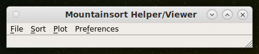

## Instructions for setting up MountainSort (with trodes)

NOTE: The current set of scripts work ONLY IN LINUX. If you are using some other operating systems, the scripts do not support it at the moment.

0. If you don't have conda, I highly recommend installing conda first for managing environments. Follow the instructions on https://docs.conda.io/projects/conda/en/latest/user-guide/install/linux.html to get started with a conda installation.

1. Use conda for setting up a virtual environment

            $ conda create -n mountainlab
            $ conda activate mountainlab

2. Install mountain lab, its processors and visualization tools

            $ conda install -c flatiron -c conda-forge mountainlab mountainlab_pytools
            $ conda install -c flatiron -c conda-forge ml_ephys
            $ conda install -c flatiron -c conda-forge qt-mountainview ephys-viz

3. Install helper functions and other algorithms

            $ conda install -c flatiron -c conda-forge ml_ms3
            $ conda install -c flatiron -c conda-forge ml_pyms
            $ conda install -c flatiron -c conda-forge ml_ms4alg

The github page says that qt-mountainview is a temporary solution while they develop ephys-viz (In case stuff stops working in the future).

4. Test that the installation works by running their hello world process

            $ ml-run-process hello.world

5. Time to do some spike sorting.
    a. Generate MDA from the spike-gadgets .rec file

    $ exportmda -rec <rec_file> -outputdirectory <output_dir>

6. To sort segments, you need to add a few packages too.
    a. franklab_mstaggedcuration
    b. franklab_msdrift

    Find them on franklab's bitbucket page. We should probably make a copy for
    ourselves too (one that works.)

            $ ml-config

    This should produce the package directory for conda. Go to that directory
    and add these pacakges there. Try running the code MS4batch.py. 

                ==== If running the code does not work as is ====

    For both these packages, we need to change the system-path for it to work!
    Also the mountainlab package has changed to ml_pyms from pyms

7. Download the scripts for running mountainsort from github. This can be done using the web interface on github.com, or from commandline by running

            $ git clone https://github.com/architgupta93/mountainlab-scripts.git
            
8. Navigate to the directory where the scripts were cloned and follow the next set of instructions to cluster data.

## Using the command-line sorting interface.
1. I recommend using the help functions to understand how the supplied scripts work. For example, if you run the following command, it should produce a set of commandline arguments that you can provide to run commandline sorting.

    $ python MS4batch.py --help

2. This should produce the following output:

```
usage: MS4batch.py [-h] [--animal <animal-name>]
                   [--mask-artifacts <mask-artifacts>]
                   [--clear-files <clear-files>]
                   [--tetrode-begin <tetrode-begin>]
                   [--tetrode-end <tetrode-end>] [--date YYYYMMDD]
                   [--data-dir <[MDA] data-directory>]
                   [--output-dir <output-directory>]

MountainSort Batch Helper.

optional arguments:
  -h, --help                        show this help message and exit
  --animal <animal-name>            Animal name
  --mask-artifacts <mask-artifacts> Mark signal artifacts
  --clear-files <clear-files>       Clear additional files
  --tetrode-begin <tetrode-begin>   First tetrode to sort
  --tetrode-end <tetrode-end>       Last tetrode to sort
  --date YYYYMMDD                   Experiment date
  --data-dir <[MDA] data-directory> Data directory from which MDA files should be read.
  --output-dir <output-directory>   Output directory where sorted spike data should be stored
```

The arguments help the script find 
1. the correct data location for collecting raw data to be sorted (data-dir)
2. Specifying where the output should be stored (output-dir, keep in mind that by default that the processing pipeline produces a LOT of data so you would want to specify a directory that has at least 2x-3x the space taken up by your raw recording -- See 5 for more details).
3. Tetrode begin (the MDA files are organized post-extraction as nt1.mda, nt2.mda, ...). The tetrode-begin and tetrode-end parameters offer a crude solution for re-running sorting if the program crashes in between.
4. Mask artifacts: specify an argument 1 if you want to mask out artifacts in the data.
5. Clear files: By default, this pipeline would produce a LOT of files (filtered data, masked data, whitened data, spike waveforms etc.) This can take up a lot of space. For example, a 60 minute, 64 tetrode recording can blow up to over 600GB. Set this option to 1 if you want to use default options and not curate/merge clusters. This is usually OK if you are working with a single recoding. When merging multiple recordings, I would not recommend using this option.

# Troubleshooting MS4batch.py run failures
If the step above produces python errors, it is very likely that you are missing some of the required libraries. Some of the commonly missing libraries include:

## Using the graphical interface for sorting.
1. In order to get an overview on how to run the grpahical interface for soriting, try running the helper function

    $ python MLView.py --help

```
usage: MLView.py [-h] [--animal <animal-name>] [--date YYYYMMDD]
                 [--data-dir <[MDA] data-directory>] [--raw <[npz] raw-data>]
                 [--bayesian <[npz] decoded-data>]
                 [--output-dir <output-directory>]

Spike-Analysis Qt helper.

optional arguments:
  -h, --help                        show this help message and exit
  --animal <animal-name>            Animal name
  --date YYYYMMDD                   Experiment date
  --data-dir <[MDA] data-directory> Data directory from which MDA files should be read.
  --raw <[npz] raw-data>            Raw data to be imported as a numpy archive.
  --bayesian <[npz] decoded-data>   Decoded data to be imported as a numpy archive.
  --output-dir <output-directory>   Output directory where sorted spike data should be stored
```

2. Running this should open up a window 



Read more details [here](https://github.com/architgupta93/mountainlab-scripts) Look below the file contents for a description on how to us e the data.

## Working with MountainSort output
